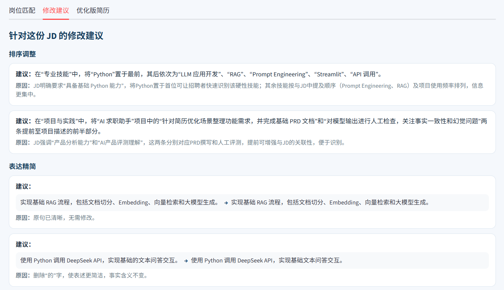

# AI 简历优化助手（AI Career Assistant）

面向求职场景的 AI 简历优化应用。用户上传简历并输入目标岗位 JD 后，系统完成岗位匹配、简历优化与事实审核，并输出一版基于原始事实的优化版简历。

项目重点解决普通大模型在简历优化中容易出现的事实扩展、能力夸大和输出格式不稳定等问题。核心原则是优化表达，但不虚构经历。

## 核心功能

<table>
<tr><th align="left" width="24%">功能</th><th align="left">说明</th></tr>
<tr><td><b>简历与 JD 输入</b></td><td>支持上传 PDF 简历并输入目标岗位 JD；分析前检查简历文本是否能够正常提取，避免无效输入继续进入后续流程。</td></tr>
<tr><td><b>岗位匹配</b></td><td>逐项解析 JD 要求，并根据简历事实判断为“已满足 / 部分相关 / 当前未体现”，同时展示对应证据与说明。</td></tr>
<tr><td><b>修改建议</b></td><td>结合目标岗位要求和 RAG 检索到的简历撰写知识，给出信息排序、措辞优化及后续补充建议。</td></tr>
<tr><td><b>优化版简历</b></td><td>优化结果先经过事实审核，再生成基于原始事实的优化版简历，并支持一键复制和 TXT 下载。</td></tr>
</table>

## 产品预览

<table>
<tr>
<td width="50%" align="center"><b>首页</b> </td>
<td width="50%" align="center"><b>岗位匹配</b> </td>
<td width="50%" align="center"><b>修改建议</b> </td>
<td width="50%" align="center"><b>优化版简历</b> </td>
</tr>
</table>

## AI 处理流程

系统采用多阶段 AI Pipeline，将简历事实提取、JD 要求提取、事实-JD 匹配、RAG 检索、简历优化和事实审核拆分处理。简历与 JD 作为直接输入，RAG 检索结果仅作为优化阶段的参考知识；最终生成结果还会重新对照原始简历事实进行审核。

## 事实约束设计

本项目的核心设计是 Grounded Resume Optimization。相比单纯追求“写得更好”，系统更强调所有最终进入优化版简历的内容都必须能够追溯到用户原始简历中的明确事实。

例如，原始经历为“实现基础 RAG 流程”，系统不会将其扩写为“独立完成完整 RAG 系统”；技能栏中存在 Python，也不会据此推断某项 RAG 实践一定使用了 Python。系统同时保留“基础、参与、简单”等会影响事实的限定词，不会生成用户未提供的结果，也不会跨项目拼接事实。

## 模型评估

项目目前包含 6 组回归测试用例，覆盖不同匹配强度和事实边界场景，主要检查事实一致性、幻觉控制、信息完整性、JD 利用程度和优化价值。当前主要采用 LLM-as-a-Judge 辅助评估，用于发现版本回归问题，而不是作为绝对准确率指标。

## 技术栈

<table>
<tr><th align="left" width="24%">模块</th><th align="left">技术</th></tr>
<tr><td><b>AI / LLM</b></td><td>DeepSeek API、OpenAI Python SDK、Prompt Engineering、Structured Output、LLM-as-a-Judge</td></tr>
<tr><td><b>RAG</b></td><td>Sentence Transformers、BAAI/bge-small-zh-v1.5、ChromaDB、Embedding、Vector Retrieval</td></tr>
<tr><td><b>应用开发</b></td><td>Python、Streamlit、pypdf、python-dotenv</td></tr>
</table>

## 快速开始

<table>
<tr><th align="left" width="18%">步骤</th><th align="left">操作</th></tr>
<tr><td><b>1. 安装依赖</b></td><td><code>pip install -r requirements.txt</code></td></tr>
<tr><td><b>2. 配置密钥</b></td><td>在项目根目录创建 <code>.env</code>，并写入 <code>DEEPSEEK_API_KEY=your_api_key</code></td></tr>
<tr><td><b>3. 启动应用</b></td><td><code>streamlit run app.py</code></td></tr>
</table>

.env 包含 API Key，请勿提交到公开仓库。

## 当前状态与后续规划

<table>
<tr><th align="left" width="50%">当前局限</th><th align="left">后续计划</th></tr>
<tr><td>扫描版 PDF 暂不支持 OCR；复杂双栏或特殊排版仍需进一步测试。</td><td>补充 OCR 能力，并继续完善 PDF / DOCX 等简历格式兼容性。</td></tr>
<tr><td>RAG 知识库规模仍较小。</td><td>扩充简历优化知识内容，并增加更丰富的检索与评测样本。</td></tr>
<tr><td>模型评估目前仍较依赖 LLM Judge。</td><td>增加确定性规则、人工检查和更多回归用例，提升评估可靠性。</td></tr>
<tr><td>多阶段 LLM 调用会增加响应时间和 API 成本。</td><td>进一步优化调用链路，并在部署阶段评估延迟与成本表现。</td></tr>
<tr><td>当前尚未正式在线部署，也未接入真实用户反馈。</td><td>完成在线 Demo，并逐步增加基础埋点和“采纳 / 不采纳”反馈。</td></tr>
</table>

## 产品文档

详细的产品需求与设计说明见：AI简历优化助手PRD.docx

