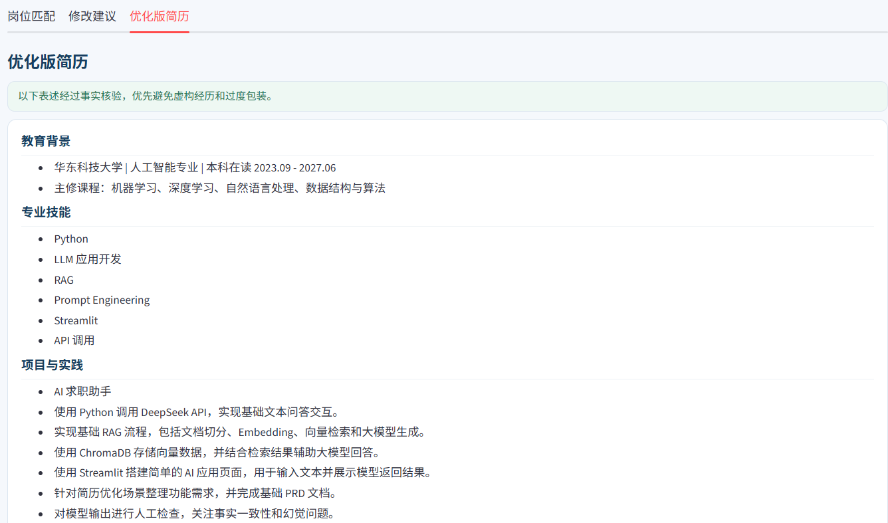

AI 简历优化助手

AI Career Assistant · 面向求职场景的 AI 简历优化应用
岗位匹配 · RAG 辅助优化 · 事实审核 · 安全版简历 · 模型评估

 

项目简介

AI 简历优化助手用于帮助求职者针对目标岗位 JD 调整简历。

用户上传简历并输入 JD 后，系统会完成：

岗位要求解析 → 简历事实匹配 → RAG 辅助优化 → 事实审核 → 安全版简历输出

项目重点解决普通大模型在简历优化中容易出现的 事实扩展、能力夸大、跨经历拼接和输出格式不稳定 等问题。

核心原则：优化表达，但不虚构经历。

产品预览

<table>
<tr>
<td width="50%" align="center">
<b>岗位匹配</b>  

</td>
<td width="50%" align="center">
<b>安全版简历</b>  

</td>
</tr>
</table>

截图放入 assets/ 目录后即可在 GitHub 中直接显示。

核心能力

<table>
  <thead>
    <tr>
      <th align="left" width="26%">能力</th>
      <th align="left">说明</th>
    </tr>
  </thead>
  <tbody>
    <tr>
      <td><b>岗位匹配</b></td>
      <td>逐项解析 JD，并判断为“已满足 / 部分相关 / 当前未体现”</td>
    </tr>
    <tr>
      <td><b>RAG 辅助优化</b></td>
      <td>检索简历撰写知识，辅助信息排序与措辞优化</td>
    </tr>
    <tr>
      <td><b>事实约束优化</b></td>
      <td>最终简历内容必须能够追溯到用户原始事实</td>
    </tr>
    <tr>
      <td><b>事实审核</b></td>
      <td>优化结果先经过独立审核，再生成安全版简历</td>
    </tr>
    <tr>
      <td><b>结构化输出</b></td>
      <td>核心结果使用 JSON，降低自然语言格式变化对前端的影响</td>
    </tr>
    <tr>
      <td><b>模型评测</b></td>
      <td>使用 6 组回归测试持续检查事实一致性、幻觉与信息完整性</td>
    </tr>
  </tbody>
</table>

系统流程

系统将简历事实提取、JD 解析、岗位匹配、RAG 检索、简历优化和事实审核拆分为多个阶段，以降低单次生成任务过多带来的不稳定性。

事实约束设计

本项目最核心的设计是 Grounded Resume Optimization：

所有最终进入安全版简历的内容，都必须有原始简历事实作为依据。

示例

<table>
  <thead>
    <tr>
      <th align="left">表述</th>
      <th align="left" width="32%">判断</th>
    </tr>
  </thead>
  <tbody>
    <tr>
      <td>实现基础 RAG 流程</td>
      <td>✅ 可保留</td>
    </tr>
    <tr>
      <td>独立完成完整 RAG 系统</td>
      <td>❌ 原文无依据，不允许生成</td>
    </tr>
  </tbody>
</table>

同时禁止：

根据技能栏推断某个项目具体使用了该技术

删除“基础、参与、简单”等影响事实强度的限定词

自动生成用户未提供的量化结果

跨项目、跨字段合并独立事实

新增原文不存在的程度词、责任词或评价词

模型评测（Evaluation）

项目目前包含 6 组回归测试用例，主要检查：

事实一致性

幻觉控制

信息完整性

JD 利用程度

优化价值

当前主要采用 LLM-as-a-Judge 辅助评测。

Evaluation 用于发现版本回归问题，而不是作为绝对准确率指标。

技术栈

<table>
<tr>
<td width="33%" valign="top">

AI / LLM

DeepSeek API

OpenAI Python SDK

Prompt Engineering

Structured Output

LLM-as-a-Judge

</td>
<td width="33%" valign="top">

RAG

Sentence Transformers

BAAI/bge-small-zh-v1.5

ChromaDB

Embedding

Vector Retrieval

</td>
<td width="33%" valign="top">

应用开发

Python

Streamlit

pypdf

python-dotenv

</td>
</tr>
</table>

快速开始

1. 安装依赖

pip install -r requirements.txt

2. 配置环境变量

在项目根目录创建 .env：

DEEPSEEK_API_KEY=your_api_key

3. 启动应用

streamlit run app.py

或：

python -m streamlit run app.py

.env 包含 API Key，请勿提交到公开仓库。

项目结构

AI-Career-Assistant/
  app.py
  main.py
  requirements.txt
  README.md
  .gitignore
  data/
  tests/
  assets/
  docs/

当前局限

暂不支持扫描版 PDF 的 OCR

复杂双栏或特殊排版简历仍需进一步测试

RAG 知识库规模较小

Evaluation 仍较依赖 LLM Judge

多阶段 LLM 调用会增加响应时间和 API 成本

当前尚未正式在线部署

后续规划

支持 DOCX 等简历格式

完善 PDF 版式兼容性

完成线上部署与 Demo

增加“采纳 / 不采纳”反馈

扩充 Evaluation Cases

探索 OCR 与更完善的事实验证方式

产品文档

完整 PRD 计划放置于：

docs/AI_Career_Assistant_V0.8_PRD.docx

内容包括产品背景、功能方案、AI 能力设计、数据指标与后续规划。

AI Career Assistant

从“AI 能生成”进一步走向“AI 能基于事实生成”。

