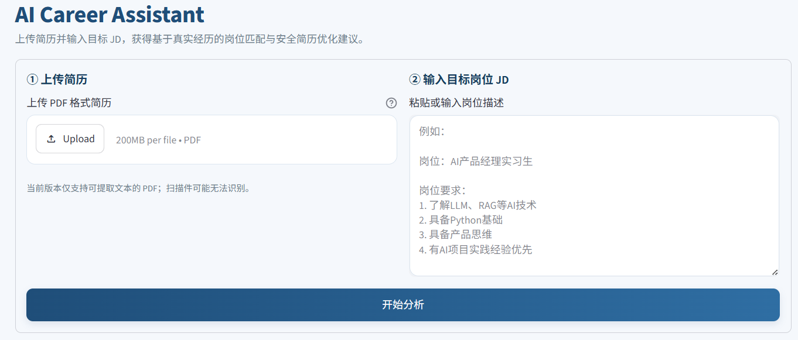
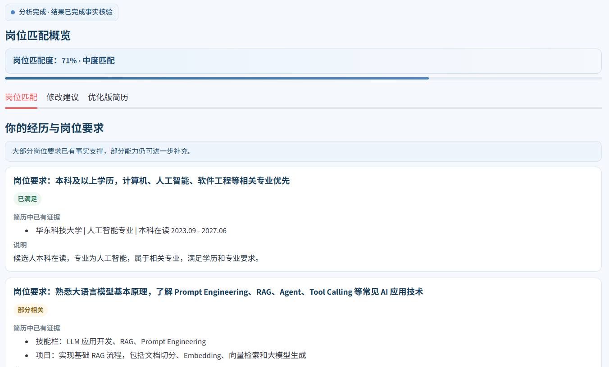
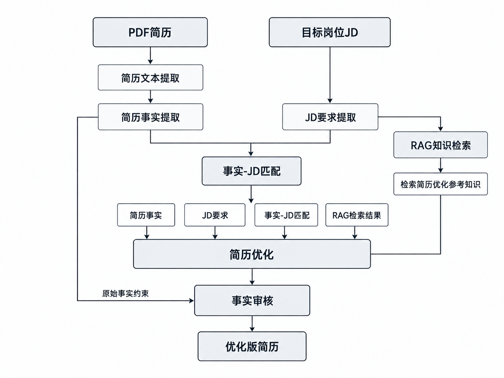

diff --git a/README.md b/README.md
index 6d7d103..44d0533 100644
--- a/README.md
+++ b/README.md
@@ -1,237 +1,75 @@
-AI简历优化助手（AI Career Assistant）
+AI 简历优化助手（AI Career Assistant）
 
-面向求职场景的 AI 简历优化应用。用户上传简历并输入目标岗位 JD 后，系统完成岗位匹配、简历优化、事实审核，并输出优化版简历。
+面向求职场景的 AI 简历优化应用。用户上传简历并输入目标岗位 JD 后，系统完成岗位匹配、简历优化、事实审核，并输出一版基于原始事实的优化版简历。当前版本：V0.8。
 
-项目重点解决通用大模型在简历优化中容易出现的事实扩展、能力夸大与输出不稳定问题，并通过 Grounded Resume Optimization、Structured Output、Fact Verification 和 Evaluation 提高结果的可控性。
+项目重点解决普通大模型在简历优化中容易出现的事实扩展、能力夸大、跨经历拼接和输出格式不稳定等问题。核心原则是：优化表达，但不虚构经历。
 
-当前版本：V0.8
+核心功能
 
-产品预览
-
-
-
-
-
-将最终截图保存到 assets/ 目录后即可在 GitHub README 中直接显示。建议保留 2～4 张代表性截图。
-
-产品结构
-
-
-
-
-
-核心能力
-
-岗位匹配：逐项解析 JD 要求，并判断为“已满足 / 部分相关 / 当前未体现”
-
-RAG 辅助优化：检索简历撰写知识，辅助信息排序与措辞优化
-
-Grounded Resume Optimization：最终简历内容必须可追溯到原始事实
-
-Fact Verification：优化结果先进入事实审核，再生成优化版简历
-
-Structured Output：核心结果统一使用结构化 JSON，避免自然语言格式变化影响前端
-
-Evaluation：通过 6 组回归测试 Case 持续检测事实一致性、幻觉与信息完整性
-
-产品化输出：支持优化版简历预览、一键复制和 TXT 下载
-
-系统流程
-
-系统采用多阶段 AI Pipeline，将事实提取、JD 解析、岗位匹配、RAG、简历优化和事实审核拆分处理。
-
-
-
-为什么强调事实约束
-
-相比单纯追求“写得更好”，本项目更强调不通过推测提高岗位匹配度。
-
-示例：
-
-原始事实：
-实现基础 RAG 流程
-
-❌ 不允许：
-独立完成完整 RAG 系统
-
-✅ 保留：
-实现基础 RAG 流程
-
-其他约束包括：
-
-不因为技能栏存在 Python，就推断某个 RAG 实践使用了 Python
-
-不自动删除“基础、参与、简单”等会影响事实强度的限定词
-
-不生成用户未提供的量化结果
-
-不跨项目、跨字段合并事实
-
-即使新增的是“基础、初步”等更保守的限定词，只要原文没有，也不直接加入
-
-快速开始
-
-1. 安装依赖
-
-pip install -r requirements.txt
-
-2. 配置环境变量
-
-在项目根目录创建 .env：
-
-DEEPSEEK_API_KEY=your_api_key
-
-3. 启动应用
-
-streamlit run app.py
-
-或：
-
-python -m streamlit run app.py
+<table>
+<tr><th align="left" width="24%">功能</th><th align="left">说明</th></tr>
+<tr><td><b>简历与 JD 输入</b></td><td>支持上传 PDF 简历并输入目标岗位 JD；分析前先检查简历文本是否能够正常提取，避免无效输入继续进入后续流程。</td></tr>
+<tr><td><b>岗位匹配</b></td><td>逐项解析 JD 要求，并根据简历事实判断为“已满足 / 部分相关 / 当前未体现”，同时展示对应证据和说明。</td></tr>
+<tr><td><b>修改建议</b></td><td>结合目标岗位要求和 RAG 检索到的简历撰写知识，给出信息排序、措辞优化和后续补充建议。</td></tr>
+<tr><td><b>优化版简历</b></td><td>优化结果先经过事实审核，再生成基于原始事实的优化版简历，并支持一键复制和 TXT 下载。</td></tr>
+</table>
 
-.env 中包含 API Key，请勿提交到公开仓库。
-
-模型评测（Evaluation）
-
-项目设计了 6 组回归测试 Case，用于验证不同版本修改后是否出现新的事实或输出问题。
+产品预览
 
-评测维度包括：
+<table>
+<tr>
+<td width="50%" align="center"><b>首页</b> </td>
+<td width="50%" align="center"><b>岗位匹配</b> </td>
+</tr>
+</table>
 
-事实一致性
+AI 处理流程
 
-幻觉控制
+


 
-信息完整性
+系统采用多阶段 AI Pipeline，将简历事实提取、JD 要求提取、事实-JD 匹配、RAG 检索、简历优化和事实审核拆分处理。简历与 JD 作为直接输入，RAG 检索结果只作为优化阶段的参考知识；最终生成结果还会重新对照原始简历事实进行审核。
 
-JD 利用程度
+事实约束设计
 
-优化价值
+本项目的核心设计是 Grounded Resume Optimization。相比单纯追求“写得更好”，系统更强调所有最终进入优化版简历的内容都必须能够追溯到用户原始简历中的明确事实。
 
-当前主要采用 LLM-as-a-Judge 辅助评测。
+例如，原始经历是“实现基础 RAG 流程”，系统不会将其改写为“独立完成完整 RAG 系统”；技能栏中存在 Python，也不会据此推断某个 RAG 实践一定使用了 Python。除此之外，系统还限制删除“基础、参与、简单”等会改变事实强度的限定词，不生成用户未提供的量化结果，不跨项目或跨字段合并独立事实，也不新增原文不存在的程度词、责任词或评价词。
 
-Evaluation 主要用于版本回归和发现问题，不作为绝对准确率指标。
+模型评估
 
-LLM Judge 本身也可能存在偏差，因此项目会结合失败案例持续补充事实规则与测试用例。
+项目目前包含 6 组回归测试用例，覆盖不同匹配强度和事实边界场景，主要检查事实一致性、幻觉控制、信息完整性、JD 利用程度和优化价值。当前主要采用 LLM-as-a-Judge 辅助评估，用于发现版本回归问题，而不是作为绝对准确率指标。
 
 技术栈
 
-AI / LLM
-
-DeepSeek API
-
-OpenAI Python SDK
-
-Prompt Engineering
-
-Structured Output
-
-LLM-as-a-Judge
-
-RAG
-
-Sentence Transformers
-
-BAAI/bge-small-zh-v1.5
-
-ChromaDB
-
-Embedding / Vector Retrieval
-
-应用开发
-
-Python
-
-Streamlit
-
-pypdf
-
-python-dotenv
-
-项目结构
-
-AI-Career-Assistant/
-  app.py
-  main.py
-  requirements.txt
-  README.md
-  .gitignore
-  data/
-    examples/
-      resume_guide.txt
-  tests/
-    case_01/
-    case_02/
-    ...
-    case_06/
-  assets/
-    core_path.png
-    function_modules.png
-    ai_pipeline.png
-    screenshot_match.png
-    screenshot_resume.png
-  docs/
-    AI_Career_Assistant_V0.8_PRD.docx
-
-当前局限
-
-扫描版 PDF 暂不支持 OCR
-
-复杂双栏或特殊排版简历仍需进一步测试
+<table>
+<tr><th align="left" width="24%">模块</th><th align="left">技术</th></tr>
+<tr><td><b>AI / LLM</b></td><td>DeepSeek API、OpenAI Python SDK、Prompt Engineering、Structured Output、LLM-as-a-Judge</td></tr>
+<tr><td><b>RAG</b></td><td>Sentence Transformers、BAAI/bge-small-zh-v1.5、ChromaDB、Embedding、Vector Retrieval</td></tr>
+<tr><td><b>应用开发</b></td><td>Python、Streamlit、pypdf、python-dotenv</td></tr>
+</table>
 
-RAG 知识库规模较小
-
-Evaluation 仍较依赖 LLM Judge
-
-多阶段 LLM 调用会增加响应时间和 API 成本
-
-当前尚未正式在线部署
-
-后续规划
-
-近期：
-
-完善不同 PDF 版式兼容性
-
-支持 DOCX 等简历格式
-
-完成线上部署
-
-补充项目截图与在线 Demo
-
-接入基础数据埋点
-
-后续：
-
-增加历史优化版本
+快速开始
 
-增加“采纳 / 不采纳”反馈
+<table>
+<tr><th align="left" width="18%">步骤</th><th align="left">操作</th></tr>
+<tr><td><b>1. 安装依赖</b></td><td><code>pip install -r requirements.txt</code></td></tr>
+<tr><td><b>2. 配置密钥</b></td><td>在项目根目录创建 <code>.env</code>，并写入 <code>DEEPSEEK_API_KEY=your_api_key</code></td></tr>
+<tr><td><b>3. 启动应用</b></td><td><code>streamlit run app.py</code></td></tr>
+</table>
 
-扩充 Evaluation Cases
+.env 包含 API Key，请勿提交到公开仓库。
 
-探索 OCR 与更完善的事实验证方式
+当前状态与后续规划
 
-在引入历史版本、跨设备同步等需求后，再评估账号体系
+<table>
+<tr><th align="left" width="50%">当前局限</th><th align="left">后续计划</th></tr>
+<tr><td>扫描版 PDF 暂不支持 OCR；复杂双栏或特殊排版仍需进一步测试。</td><td>补充 OCR 能力，并继续完善 PDF / DOCX 等简历格式兼容性。</td></tr>
+<tr><td>RAG 知识库规模仍较小。</td><td>扩充简历优化知识内容，并增加更丰富的检索与评测样本。</td></tr>
+<tr><td>模型评估目前仍较依赖 LLM Judge。</td><td>增加确定性规则、人工检查和更多回归用例，提升评估可靠性。</td></tr>
+<tr><td>多阶段 LLM 调用会增加响应时间和 API 成本。</td><td>进一步优化调用链路，并在部署阶段评估延迟与成本表现。</td></tr>
+<tr><td>当前尚未正式在线部署，也未接入真实用户反馈。</td><td>完成在线 Demo，并逐步增加基础埋点和“采纳 / 不采纳”反馈。</td></tr>
+</table>
 
 产品文档
 
-项目同时整理了产品需求与设计文档（PRD），用于记录：
-
-产品背景与目标
-
-核心用户路径与功能模块
-
-AI 能力与关键设计
-
-数据指标与埋点设计
-
-迭代与后续规划
-
-TODO：后续将 PRD 放入 docs/ 目录并补充链接。
-
-项目定位
-
-该项目并非单纯的大模型调用 Demo，而是围绕真实求职场景完成的一次 AI 产品实践：
-
-LLM + RAG + Grounded Generation + Structured Output + Evaluation + 产品化前端
-
-当前版本仍在持续迭代中。
\ No newline at end of file
+完整 PRD 计划放置于 docs/AI_Career_Assistant_V0.8_PRD.docx，主要记录产品背景与目标、核心功能、AI 能力设计、数据指标与埋点，以及后续规划。
\ No newline at end of file
